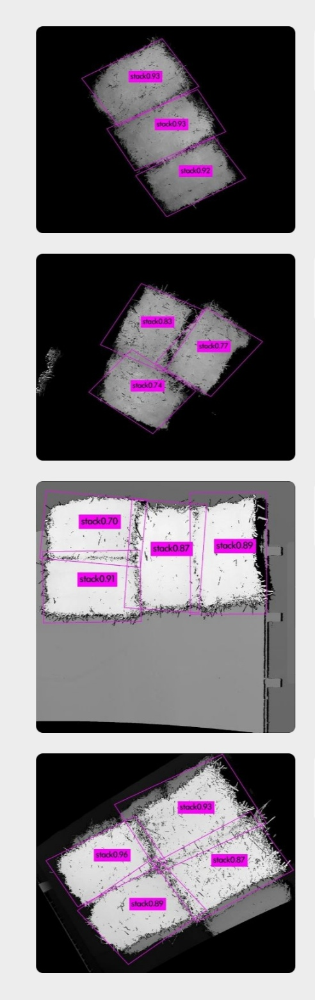

# rodarknet
基于yoloV2的旋转框目标检测

基础代码 [darknet](https://github.com/AlexeyAB/darknet)

###  一些工作：  
*  添加了详细注释，从数据加载至结果输出
*  增加了旋转框目标识别功能，涉及到数据流修改，网络结构微调等。

###  一些关键算法：
*  旋转矩形求交 -> 三角剖分 (新版OpenCV实现了此功能)
*  旋转矩形NMS

###  使用方法：
*  训练方式和文件修改与原darknet基本一致，输出的时候多一维数据。
*  结果演示  
  

### 参考论文：
[Arbitrary-Oriented Scene Text Detection via Rotation Proposals](https://arxiv.org/abs/1703.01086)